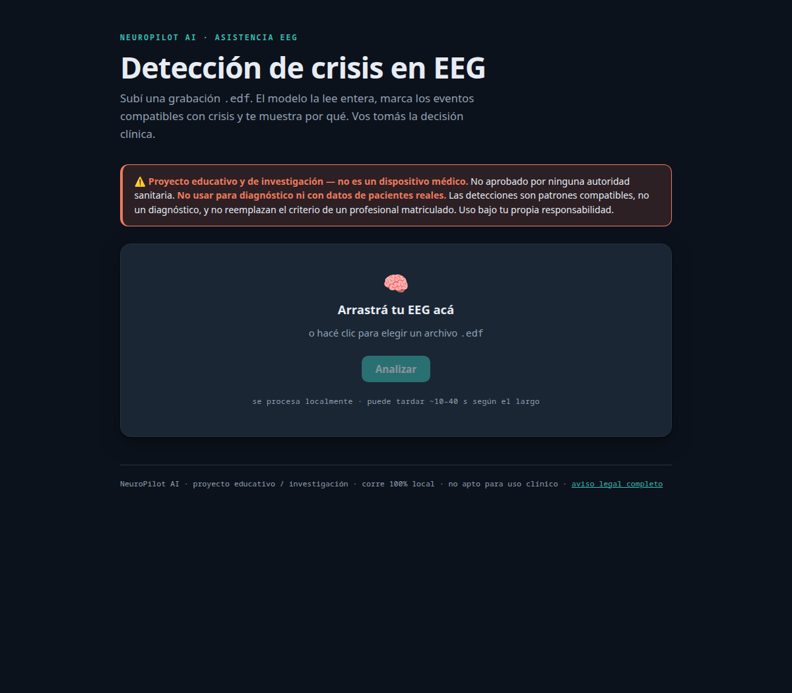
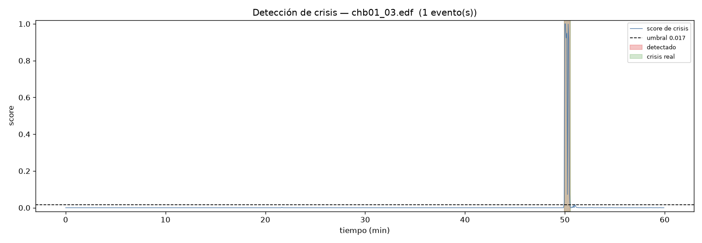
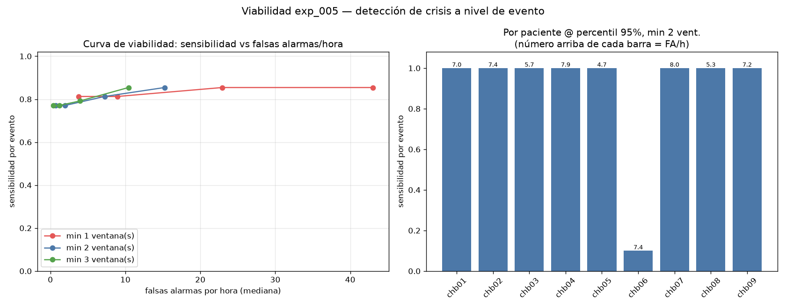

# NeuroPilot AI — detección de crisis epilépticas en EEG

> ⚠️ **Descargo:** Proyecto **educativo y de investigación**. NeuroPilot AI **no** es un dispositivo médico, no está aprobado para uso clínico y **no debe usarse para diagnóstico ni decisiones sobre pacientes reales**. Ver [LEGAL.md](LEGAL.md).

**Una IA que lee un EEG, marca dónde hay patrones compatibles con crisis epilépticas, con
su nivel de confianza y una explicación, para acelerar la revisión de un profesional.**
Herramienta de **asistencia**, no de diagnóstico.



**Lo que ve la IA** sobre una hora de EEG crudo: el score se mantiene casi en cero y solo se
dispara en la crisis real (minuto 50). Lo detectado (rojo) cae justo sobre la crisis real (verde).



---

## El enfoque: honestidad antes que el número

La prioridad de este proyecto no fue un número lindo, sino **medir con honestidad y mostrar
dónde el modelo se rompe**.

Las crisis son ~1 % de una señal EEG: un modelo que diga *"no hay crisis"* siempre "acierta"
el 99 %… sin detectar una sola crisis. Por eso acá **todo se evalúa en pacientes que el modelo nunca vio**
(validación cross-paciente, LOSO), con métricas clínicas (cobertura por evento vs falsas
alarmas por hora), no accuracy.

## Resultados (honestos)

| Escenario | Cobertura de crisis |
|---|---|
| Pacientes típicos (LOSO, no vistos) | **81 %** y 8 de 9 al **100 %**, con < 1 falsa alarma/hora |
| Paciente nuevo y **atípico**, sin adaptar (zero-shot) | **6–20 %** (el problema difícil) |
| Ese mismo paciente, **adaptado** | **91–100 %** |

> "Funciona" no es un número: depende del escenario. La generalización *zero-shot* a un
> paciente arbitrario es un problema abierto; con **adaptación al paciente**, como los
> detectores clínicos reales, se recupera de forma dramática.



## El recorrido (con los fracasos incluidos)

baseline → CNN que **fracasó** (peor que el azar) → diagnóstico: **la normalización** era
el 87 % del problema → CNN que supera al baseline → **error analysis** del paciente que
falla → **calibración por paciente** sin leakage → **viabilidad por evento** → **dos mejoras
rechazadas con evidencia** (híbrido, 2da etapa) → **reality-check** (falla en un paciente
100 % nuevo) → **la solución: [adaptación al paciente](docs/adaptacion.md)** (chb06: 20 %→100 %, chb12: 6 %→91 %).

La historia completa, paso a paso, en **[historia.md](historia.md)**.

## Cómo funciona (en breve)

- **El modelo:** una **red neuronal convolucional 1D (CNN)** que aprende directamente de la
  señal cruda de los 23 canales del EEG, más un modelo clásico simple (potencia por bandas +
  regresión logística) como *baseline* de comparación. Todo en PyTorch.
- **El entrenamiento:** el EEG se corta en **ventanas de 4 segundos** etiquetadas (crisis /
  normal), se **normaliza por canal**, y la red aprende con el bucle *"adivinar, medir el
  error, ajustar"*. Se entrenan dos versiones: una para **evaluar** honestamente (LOSO, deja
  un paciente afuera) y otra para **usar** (todos los pacientes). Paso a paso en
  [docs/pipeline.md](docs/pipeline.md).
- **Cómo corre:** **100 % local.** La web (FastAPI) y la inferencia corren en tu máquina;
  ningún dato sale de ahí (importante con datos de salud). No usa la nube. El modelo
  entrenado (316 KB) viene incluido en el repo (`models/deployment_v1.pt`).
- **Adaptar a un paciente:** para un paciente atípico, un *fine-tuning* corto con unas pocas
  crisis suyas ya etiquetadas + un normalizador propio suben mucho la detección (así se
  rescataron chb06 y chb12). Hoy es **por línea de comando** (la web es solo detección); qué
  es y cómo, paso a paso, en [docs/adaptacion.md](docs/adaptacion.md).
- **¿Términos técnicos?** *LOSO, zero-shot, fine-tuning, AUPRC, leakage* y demás están
  explicados en una línea cada uno en el **[glosario](docs/glosario.md)**.

## Probalo

```bash
# instalar
python -m venv .venv && . .venv/bin/activate
pip install -r requirements.txt && pip install -e .

# opción A — web local (subís un .edf y ves detección + explicación)
uvicorn app.main:app --host 127.0.0.1 --port 8000   # abrí http://127.0.0.1:8000

# opción B — línea de comando
python -m neuropilot.inference.detector registro.edf --explain

# adaptar el modelo a un paciente (few-shot) y detectar mejor en sus registros
python -m neuropilot.inference.adapt --patient-dir /ruta/chbNN \
    --files chbNN_01.edf chbNN_03.edf --out models/chbNN_adapted.pt
```

Datos: [CHB-MIT Scalp EEG](https://physionet.org/content/chbmit/) (público, anonimizado).
El modelo de despliegue viene incluido (`models/deployment_v1.pt`).

## Stack

Python · PyTorch · MNE-Python · scikit-learn · NumPy/SciPy · FastAPI · pytest · **120 tests** ✅

## Documentación

| Documento | Contenido |
|---|---|
| [`historia.md`](historia.md) | **La historia del proyecto**: problema, experimentos y decisiones (empezá acá) |
| [`docs/pipeline.md`](docs/pipeline.md) | Mapa de archivos del pipeline (entrenamiento, normalización, modelo) + cómo viaja el dato |
| [`docs/adaptacion.md`](docs/adaptacion.md) | Qué es adaptar el modelo a un paciente y cómo se hace |
| [`docs/comandos.md`](docs/comandos.md) | Todos los comandos importantes (instalar, correr, entrenar, adaptar) |
| [`docs/glosario.md`](docs/glosario.md) | Conceptos clave explicados en una línea |
| [`docs/research.md`](docs/research.md) | Metodología científica (cómo no engañarse) |
| [`docs/architecture.md`](docs/architecture.md) | Arquitectura técnica y decisiones |
| [`docs/explainability.md`](docs/explainability.md) | Qué ve el médico: visualización y explicabilidad |
| [`experiments/`](experiments/) | Cada experimento con su reporte y figuras |
| [`LEGAL.md`](LEGAL.md) | Aviso legal y descargo (uso educativo, no clínico) |

## Conclusiones

- **La honestidad fue la decisión de diseño más importante.** Evaluar en pacientes no
  vistos y con métricas clínicas (no accuracy) mostró la realidad: el modelo funciona muy
  bien en muchos pacientes y falla en algunos atípicos. Preferí saberlo a taparlo.
- **Un resultado negativo bien medido vale tanto como uno positivo.** El primer CNN, el
  híbrido y la segunda etapa se descartaron con evidencia. Saber cuándo *no* agregar
  complejidad también es ingeniería.
- **La generalización zero-shot cross-paciente es el problema difícil; la adaptación al
  paciente lo resuelve**, tal como se despliegan los detectores clínicos reales.

## Limitaciones y próximos pasos

Lo que falta, sin maquillar:

- Muestra chica (11 pacientes; dataset pediátrico y relativamente controlado).
- La generalización a un paciente nuevo atípico **requiere adaptación** (algo de dato
  etiquetado de ese paciente).
- Sin validación en un dataset externo todavía.

Lo que seguiría:

- **Validación externa** para medir la degradación entre hospitales.
- **Estudio sistemático de adaptación:** cuánto dato del paciente hace falta para recuperar.
- **Modo patient-adapt en la web:** adaptar y detectar sin tocar la terminal.

## Licencia

Código bajo licencia [MIT](LICENSE) — usalo libremente con atribución. Es un proyecto
**educativo y de investigación**: uso clínico no soportado (ver [LEGAL.md](LEGAL.md)).

---

⚕️ NeuroPilot AI produce predicciones y patrones compatibles, **nunca diagnósticos
confirmados**. No reemplaza el criterio médico.
